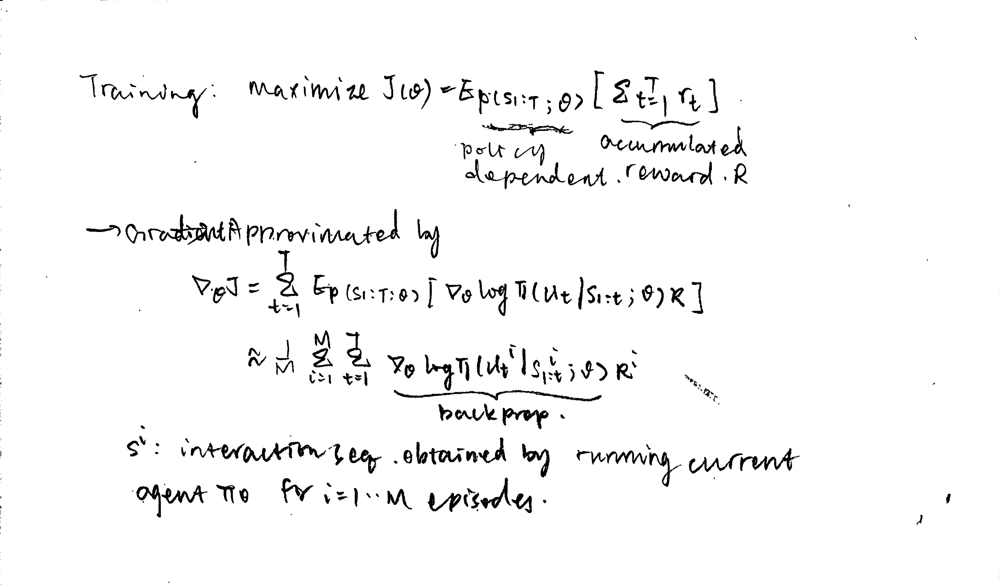

# The Recurrent Attention Model (RAM)
Volodymyr Mnih, Nicolas Heess, Alex Graves, Koray Kavukcuoglu. Recurrent Models of Visual Attention. 2014. 
https://papers.nips.cc/paper/5542-recurrent-models-of-visual-attention.pdf

### Previous Work
- Window classifier design based:
    - Efforts have been made to speed up computation by reducing number of windows to be evaluated. 
    - e.g. R-CNN, Fast R-CNN, Faster R-CNN, Region-based Fully Convolutional Network (R-FCN), Feature Pyramid Network (FPN) for object detection. 
    - Limited exploitation of past information. 
- Saliency detection based:
    - Salient image regions are identified based on and often restricted to low-level features. 
    - Does not integrate information across fixations. 
    - Typically ignores semantic content and task demands. 
- Sequential decision view based:
    - Decide next attention based on previous fixations of the image. 

### Overview
- Adaptively selects a sequence of regions and process regions with high resolution. 
- End-to-end optimization, employing reinforcement learning methods to learn task-specific policies. 

### Model

